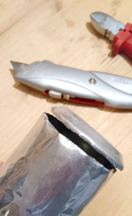
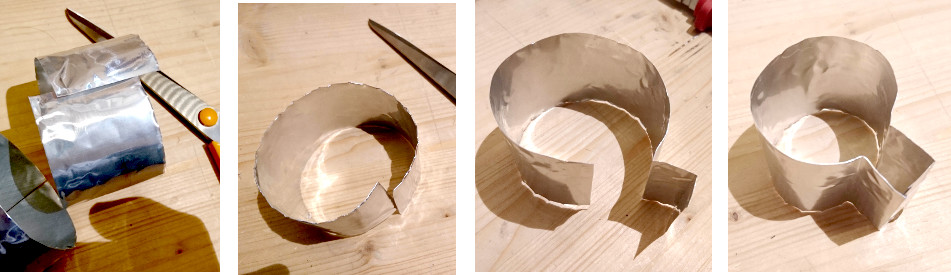
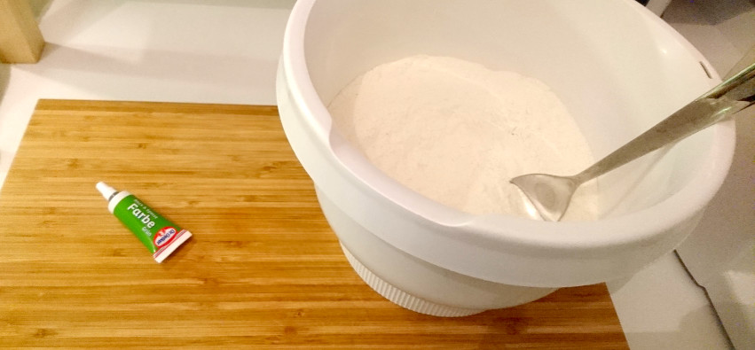
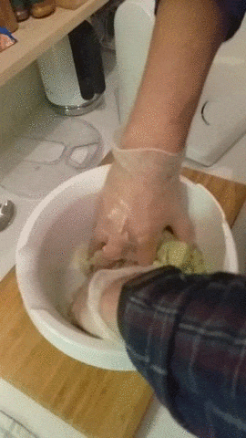
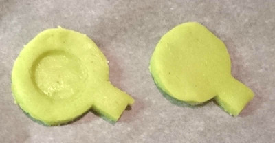
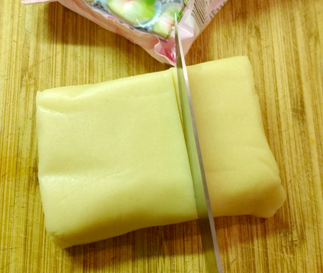
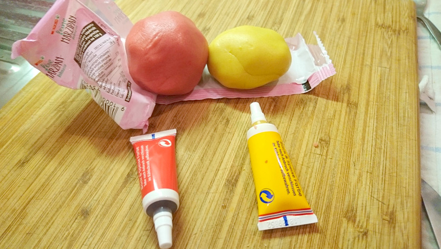
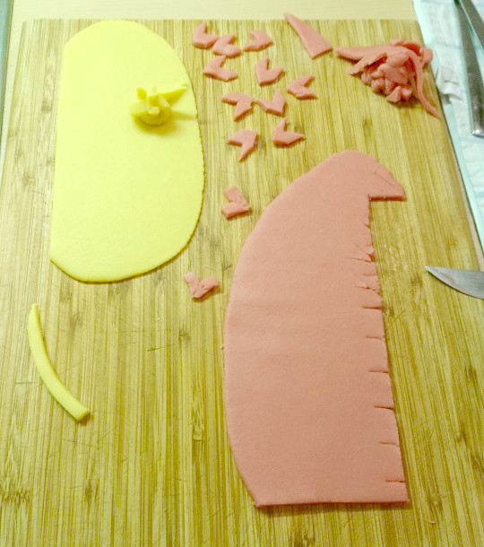
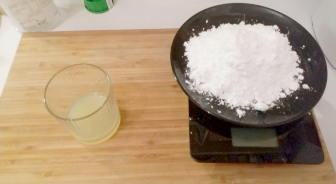
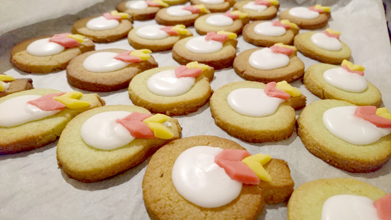

# QGIS Qkies

## Ingridients

- Metal Can
- 500 g Flour
- 250 g Butter
- 200 g Sugar
- 1/2 pack of Baking Powder
- 1 pack of vanilla flavoured sugar
- 1 big egg
- 1 Lemon
- Food Coloring (green, red, yellow)
- Marzipan
- 200 g Icing Sugar for the icing

## Cookie Cutter

First, we have to build our cookie cutter for our Qkies. We could buy one resembling the letter "Q" - but hey, we're open source, so we build our own.

For this I took an old metal can and removed the bottom with a knife.

After that I could easily use scissors to extract a small round piece of the can.
This piece has to be formed into a rough "Q" shape. With my shape, I forgot to form the end into an arrow like it is with the QGIS Logo.

## Preparing the Dough

Mix the flour, sugar, butter, vanilla suger, grated lemon peel, the baking powder, the egg and some green food coloring together.

Do not knead it for too long or the butter will get too warm.

After that, place the dough in the refridgerator for about 30 minutes.

When the dough has cooled down enough, you can roll it out and cut "Q" formed pieces by using our Qkie cutter from it.

To form a slightly lower ring inside the cookie, you can use a bottle cap:

## Baking

Bake the cookies for about 7 Minutes at 200°C.

## Decoration

To actually make these "Q"s look like the QGIS logo, we have to prepare colored marzipan and some icing.

### Marzipan

About 1/3 of it has to be colored yellow, and 2/3 of it will become red.

Roll out these two portions of marzipan, then you can start cutting out little arrows which we need later on to decorate our "Q"s.

### Icing

For the icing, just mix the powdered sugar and the juice of one lemon together.

This will result in a smooth mixture.

### Finalizing the Cookies

After the "Q"s have finished baking, you can start the decoration process to create little QGIS logos.
For this, put a spoonfull of icing into the middle of the "Q"s and put one red and one yellow marzipan arrow alongside its pointy end.

